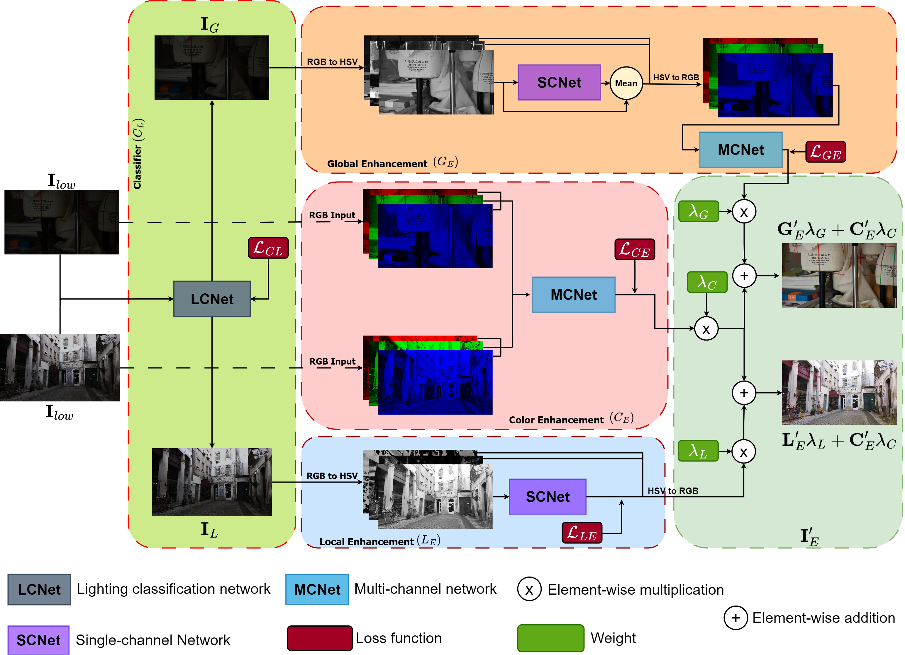

# [MS2025] ALEN: A Dual-Approach for Uniform and Non-Uniform Low-Light Image Enhancement 


[Ezequiel Perez-Zarate](https://scholar.google.com/citations?user=sNlxp40AAAAJ&hl=es&oi=sra). [Oscar Ramos-Soto](https://scholar.google.com/citations?user=EzhiQbkAAAAJ&hl=es&oi=sra), Chunxiao Liu, [Diego Oliva](https://scholar.google.com/citations?user=N5mk5rYAAAAJ&hl=es), [Marco Perez-Cisneros](https://scholar.google.com/citations?user=7fH_0XQAAAAJ&hl=es)


## 🎯 1. Overview

This repository contains the source code and supplementary materials for the paper **"ALEN: A Dual-Approach for Uniform and Non-Uniform Low-Light Image Enhancement"**. The research focuses on enhancing low-light images and has been accepted for publication in the Multimedia Systems journal, published by Springer.



## 🛠️ 2. Requirements

1. opencv-python == 4.9.0.80
2. scikit-image == 0.22.0
3. numpy == 1.24.3
4. torch == 2.3.0+cu118
5. Pillow == 10.2.0
6. tqdm ==  4.65.0
7. natsort == 8.4.0
8. torchvision == 0.18.0+cu118

## 🧪 3. Inference
To test the model, follow these steps:


1. Download the pretrained weights from either of the following links, and place them in the `./Models` directory:  
   - [Google Drive](https://drive.google.com/drive/folders/1Wuj5s1mtm5SJDLl80ISBRzhIwnRw4K1Q)   
   - [OneDrive](https://1drv.ms/f/c/e007fd74948072f0/Ejgw93u1C2pCiBMXo9J53zcBiq3yf30GwHST3Logz7ELrA?e=RD6p96)


2. Place your images to be enhanced in the ./1_Input directory.

3. Run the code with the following command:

   ```bash
   python inference.py

4. The enhanced images will be saved in the ./2_Output directory.


## 🗂️ 4. Datasets 
This section describes the datasets used to train and evaluate the performance of **ALEN: Adaptive Light Enhancement Network** for low-light image enhancement.

### 📚 4.1. Training Datasets
The following public datasets were used to train the **ALEN** model. These datasets contain images with global and local illumination variations, necessary for effective classification and enhancement:

| **Dataset** | **Description**                                 | **Number of Images**         | **Type**              | **Resources** |
|-------------|:-----------------------------------------------:|:----------------------------:|:---------------------:|:-------------:|
| **GLI**     | Global-Local Illumination                       | 2,000                        | Paired Classification |[Dataset](https://drive.google.com/drive/folders/1L1uhe1pAOl6fqPSTB2EMVxYJ0AGeNJue?hl=es)|
| **HDR+**    | High Dynamic Range Plus                         | 922                          | Paired Enhancement    |[Paper](https://dl.acm.org/doi/abs/10.1145/2980179.2980254)/[Dataset](https://hdrplusdata.org/)  |
| **SLL**     | Synthetic Low-Light                             | 22,472                       | Paired Enhancement    |[Paper](https://link.springer.com/article/10.1007/s11263-021-01466-8)/[Dataset](https://github.com/yu-li/AGLLNet?tab=readme-ov-file)|
| **MIT**     | MIT-Adobe FiveK                                 | 5,000                        | Paired Enhancement    |[Paper](https://ieeexplore.ieee.org/abstract/document/5995413)/[Dataset](https://data.csail.mit.edu/graphics/fivek/)|


### 🧾 4.2. Evaluation Datasets
To evaluate the overall performance and generalization ability of **ALEN**, we used various datasets representing real-world scenarios:

| **Dataset**       | **Description**                                 | **Number of Images**     | **Type**                 | **Resources** |
|-------------------|:-----------------------------------------------:|:------------------------:|:------------------------:|:-------------:|
| **DIS**           | Diverse Illumination Scene                      | 10                       | Unpaired Enhancement     |[Dataset](https://drive.google.com/drive/folders/1h-fHZ5yCGTgohXXTEDWnA_ArhVv0c4nO?hl=e)|
| **LSRW**          | Large-Scale Real-World                          | 735                      | Paired Enhancement       |[Paper](https://www.sciencedirect.com/science/article/pii/S1047320322002322)/[Dataset](https://drive.google.com/drive/folders/1PVdD3ivcvyN_qMenNfyThm0HspBfNS6t?hl=es)  |
| **UHD-LOL4k**     | Ultra-High Definition LOw-Light 4K              | 735                      | Paired Enhancement       |[Paper](https://ojs.aaai.org/index.php/AAAI/article/view/25364)/[Dataset](https://drive.google.com/drive/folders/1lDruYXGXNVp-qw0VZeELCejxD__MnPr9?hl=es) |
| **DICM**          |  --------------------                           | 69                       | Unpaired Enhancement     |[Paper](https://ieeexplore.ieee.org/abstract/document/6615961)/[Dataset](https://drive.google.com/drive/folders/1FBtsAz0XHA_0S5G7izIaF_D10PtJ2H8h?usp=sharing) |
| **LIME**          | Low-light Image Enhancement                     | 10                       | Unpaired Enhancement     |[Paper](https://ieeexplore.ieee.org/abstract/document/7782813)/[Dataset](https://drive.google.com/drive/folders/14VlIsJtMfrf2kENE2W04BbdzTOiGZO0M?usp=sharing) |
| **MEF**           | Multi-Exposure Fusion                           | 17                       | Unpaired Enhancement     |[Paper](https://ieeexplore.ieee.org/abstract/document/7120119)/[Dataset](https://drive.google.com/drive/folders/1HGRiGjU63ZSwBNz_VaDYavGpSYotnKAs?usp=sharing) |
| **NPE**           | Naturalness Preserved Enhancement               | 8                        | Unpaired Enhancement     |[Paper](https://ieeexplore.ieee.org/abstract/document/6512558)/[Dataset](https://drive.google.com/drive/folders/103obQEYIzojmMtbNmY8XxgIoSCI4f_B7?usp=sharing) |
| **TM-DIED**       | The Most Difficult Image Enhancement Dataset    | 222                      | Unpaired Enhancement     |[Dataset](https://sites.google.com/site/vonikakis/datasets/tm-died)|


## 📄 Citation
If this work contributes to your research, we would appreciate it if you could cite our paper:

```bibtex
@article{perez2025alen,
  title={ALEN: a dual-approach for uniform and non-uniform low-light image enhancement},
  author={Perez-Zarate, Ezequiel and Ramos-Soto, Oscar and Liu, Chunxiao and Oliva, Diego and Perez-Cisneros, Marco},
  journal={Multimedia Systems},
  volume={31},
  number={3},
  pages={1--22},
  year={2025},
  publisher={Springer}
}

