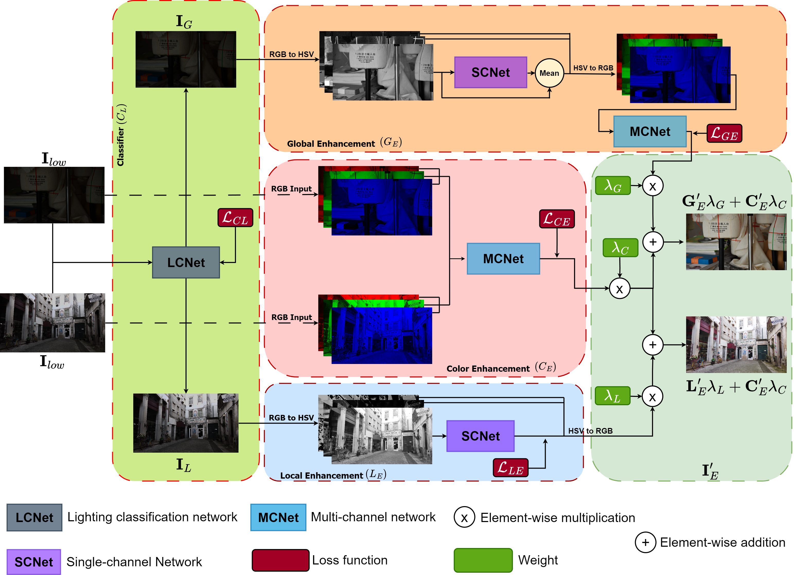

# ALEN: A Dual-Approach for Uniform and Non-Uniform Low-Light Image Enhancement

## Overview

This repository contains the source code and associated materials for the paper titled **ALEN: A Dual-Approach for Uniform and Non-Uniform Low-Light Image Enhancement**. The aim of this research is the visual enhancement of low-light images.

## Project Status

The project is currently in preparation for release. We are finalizing the codebase and documentation, and the repository will be made public shortly.

You can download the Diverse Illumination Scene (DIS) dataset used here:

[DIS Dataset](https://drive.google.com/file/d/1KQhL8EhgJPoS-88xz0Y2UfO8fjTEc9M3/view?usp=drive_link)
